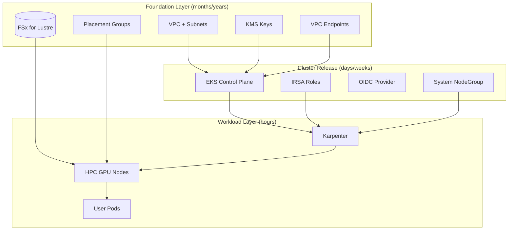
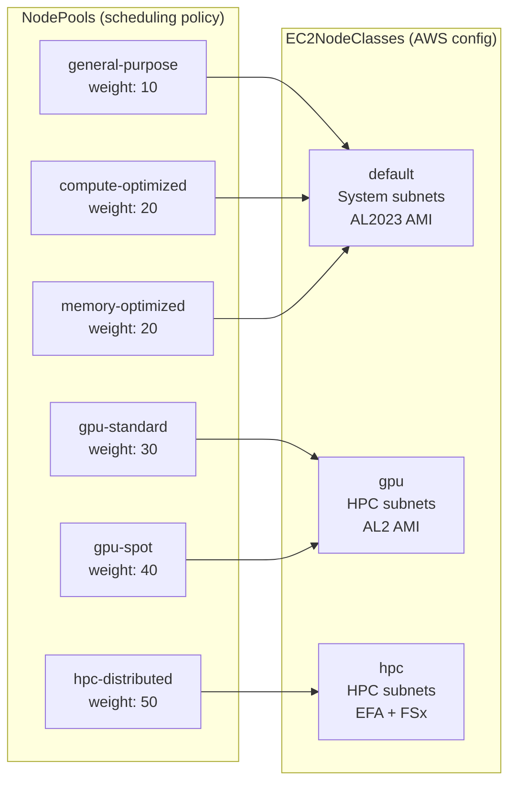
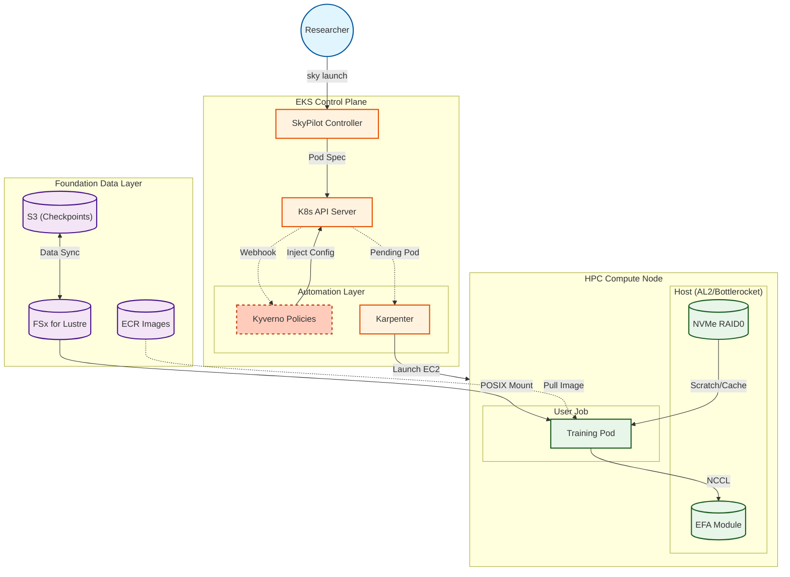

# Skyhook Architecture

## Layered Infrastructure

Skyhook uses a two-layer infrastructure model that separates long-lived resources from ephemeral compute:



## Live Environment Reference (accel-usw2)

| Resource | ID/Value |
|----------|----------|
| **Foundation** | `skyhook-accel-usw2` |
| **Cluster** | `skyhook-accel-usw2-v42` |
| **VPC** | `vpc-092d808c1bbe46da0` |
| **VPC CIDR** | `10.0.0.0/16` |
| **Region** | `us-west-2` |
| **Primary AZ** | `us-west-2a` |
| **FSx File System** | `fs-06f749f9104b7ec01` |
| **FSx DNS** | `fs-06f749f9104b7ec01.fsx.us-west-2.amazonaws.com` |
| **FSx Mount** | `a2cfrb4v` |
| **Kubernetes** | v1.32.9-eks |
| **Karpenter** | v1.2.0 |

## Karpenter NodePool Architecture

Karpenter provisions nodes using a tiered architecture with three EC2NodeClasses and six NodePools:



### NodePool Configuration

| NodePool | EC2NodeClass | Instance Families | Sizes | Capacity | Taints |
|----------|--------------|-------------------|-------|----------|--------|
| `general-purpose` | default | m5, m6i, m7i | large-4xlarge | spot+od | none |
| `compute-optimized` | default | c5, c6i, c7i | large-4xlarge | spot+od | none |
| `memory-optimized` | default | r5, r6i, r7i | large-4xlarge | spot+od | none |
| `gpu-standard` | gpu | g5, g6, p4d, p5 | varies | on-demand | `nvidia.com/gpu` |
| `gpu-spot` | gpu | g5, g4dn | varies | spot | `nvidia.com/gpu`, spot |
| `hpc-distributed` | hpc | p4d, p5 | 24xl, 48xl | on-demand | `nvidia.com/gpu`, hpc |

### EC2NodeClass Configuration

| Class | Subnets | AMI | Block Device | Special Config |
|-------|---------|-----|--------------|----------------|
| `default` | System (3 AZs) | AL2023 | 100Gi gp3 | Standard workloads |
| `gpu` | HPC (2 AZs) | AL2 | 200Gi gp3 | GPU workloads |
| `hpc` | HPC (2 AZs) | AL2 | 500Gi gp3 | FSx mount, EFA |

## Data Flow



## Directory Structure

```
SM-13/
├── foundation/              # Layer 0: Long-lived infrastructure
│   ├── templates/           # CloudFormation templates
│   │   ├── main.yaml        # Root stack orchestrator
│   │   ├── vpc.yaml         # VPC, subnets, NAT
│   │   ├── endpoints.yaml   # VPC endpoints
│   │   ├── storage.yaml     # FSx, KMS
│   │   └── placement-groups.yaml
│   ├── params/              # Environment parameters
│   └── Makefile             # foundation-up, foundation-down

├── cluster/                 # Layer 1: Ephemeral EKS clusters
│   ├── eksctl-template.yaml # Cluster configuration
│   ├── iam-cluster.yaml     # Per-cluster IRSA roles
│   └── Makefile             # cluster-up, cluster-down

├── platform/                # Layer 2: GitOps-managed services
│   └── base/
│       ├── karpenter/       # Node provisioning (v1.2.0)
│       │   ├── helmrelease.yaml
│       │   ├── ec2nodeclasses.yaml
│       │   └── nodepools.yaml
│       ├── node-termination-handler/
│       ├── dcgm-exporter/   # GPU metrics
│       ├── observability/   # Prometheus + Grafana
│       └── ...

└── docs/                    # Documentation
```

## Key Components

### Foundation Layer

| Component | Purpose | Lifecycle | Live Value |
|-----------|---------|-----------|------------|
| VPC | Network isolation, subnet design | Years | `vpc-092d808c1bbe46da0` |
| FSx for Lustre | Persistent research data | Years | `fs-06f749f9104b7ec01` |
| Placement Groups | EFA networking locality | Years | 3 groups |
| VPC Endpoints | Cost/latency optimization | Years | 13 endpoints |
| KMS Key | Encryption at rest | Years | `c3ff8c8d-...` |

### Cluster Layer

| Component | Purpose | Lifecycle | Live Value |
|-----------|---------|-----------|------------|
| EKS Control Plane | Kubernetes API | Weeks | v1.32.9-eks |
| System NodeGroup | Platform services | Weeks | 2 nodes (m5.large) |
| OIDC Provider | Pod Identity/IRSA | Weeks | Configured |
| IAM Roles | Service permissions | Weeks | Karpenter, NTH, etc. |

### Workload Layer

| Component | Purpose | Lifecycle | Live Value |
|-----------|---------|-----------|------------|
| Karpenter | Just-in-time GPU provisioning | Hours | v1.2.0, 6 NodePools |
| HPC Nodes | Training compute | Hours | On-demand |
| User Pods | Training jobs | Minutes-Days | — |

## Networking

### Subnet Allocation (10.0.0.0/16)

| Type | CIDR | IPs | Purpose | Subnet IDs |
|------|------|-----|---------|------------|
| Public | /24 × 3 | 768 | NAT, ALB | 3 subnets |
| System | /22 × 3 | 3,072 | Control plane | `subnet-02c0...`, `subnet-0414...`, `subnet-0aa8...` |
| HPC | /19 × 2 | 16,384 | GPU nodes | `subnet-0aaf...`, `subnet-05c0...` |
| Storage | /24 × 1 | 256 | FSx mount targets | `subnet-07b1...` |

### EFA + Placement Groups

- Placement groups ensure physical proximity for low-latency NCCL
- p4d/p5 instances with EFA for RDMA networking
- Three groups available:
  - `skyhook-accel-usw2-cpg-us-west-2a-alpha`
  - `skyhook-accel-usw2-cpg-us-west-2a-beta`
  - `skyhook-accel-usw2-cpg-us-west-2b-alpha`

## Storage

### FSx for Lustre

**DNS**: `fs-06f749f9104b7ec01.fsx.us-west-2.amazonaws.com`  
**Mount Name**: `a2cfrb4v`  
**Type**: PERSISTENT_2 (125 MB/s/TiB throughput)

```
/mnt/fsx/
├── datasets/        # Curated training data (read-heavy)
├── checkpoints/     # Model checkpoints (write-heavy)
├── scratch/         # Per-cluster working space
└── home/            # User directories
```

### NVMe RAID0

Each HPC node configures local NVMe as RAID0:
- `/mnt/local-scratch/` - Fast ephemeral storage
- Container image cache
- Checkpoint staging before S3 sync

## Cluster Release Model

Clusters are **immutable releases**, not environments:

```
Foundation: skyhook-accel-usw2
    │
    ├── skyhook-accel-usw2-v42    ← Current production
    ├── skyhook-accel-usw2-v43    ← Canary testing
    └── skyhook-accel-usw2-v44    ← Next release (in validation)
```

Promotion flow:
1. Create new cluster release: `make cluster-up ENV=accel-usw2 CLUSTER=v43`
2. Validate with subset of workloads
3. Promote: `make cluster-promote ENV=accel-usw2 CLUSTER=v43`
4. Drain and delete old release: `make cluster-down ENV=accel-usw2 CLUSTER=v42`

## SSM Parameter Store

All foundation outputs are stored in SSM for cluster consumption:

| Parameter | Description |
|-----------|-------------|
| `/skyhook/accel-usw2/vpc-id` | VPC ID |
| `/skyhook/accel-usw2/system-subnet-ids` | System subnet IDs (comma-separated) |
| `/skyhook/accel-usw2/hpc-subnet-ids` | HPC subnet IDs |
| `/skyhook/accel-usw2/fsx-dns-name` | FSx DNS name |
| `/skyhook/accel-usw2/fsx-mount-name` | FSx mount name |
| `/skyhook/accel-usw2/placement-groups` | Placement group names |
| `/skyhook/accel-usw2/foundation-metadata` | Full JSON metadata |
