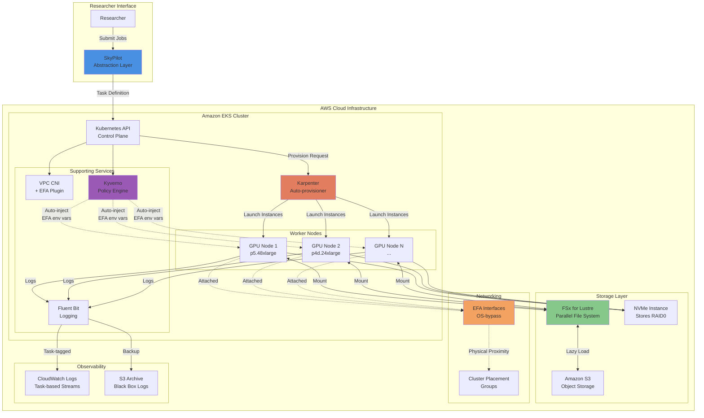
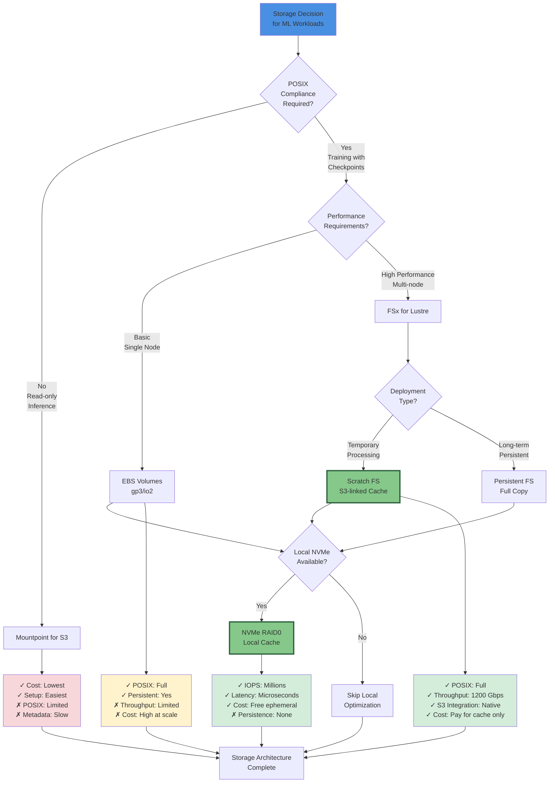
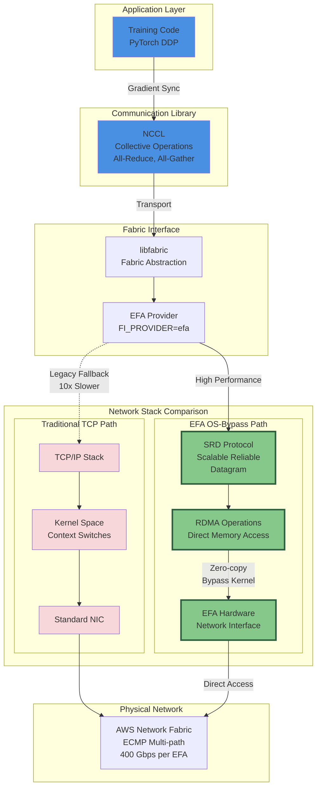
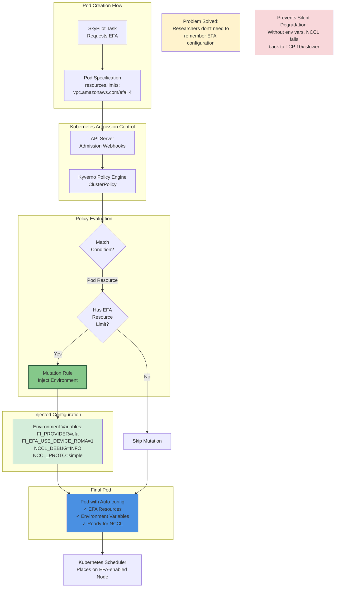
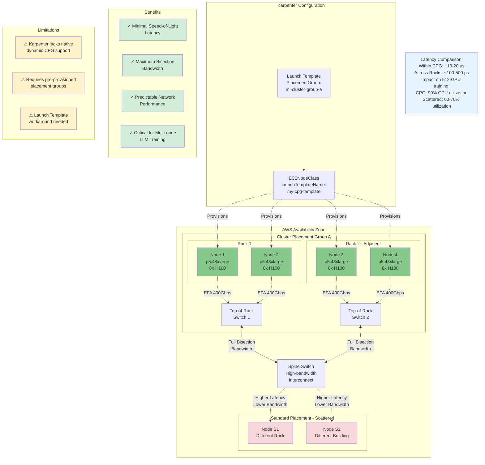
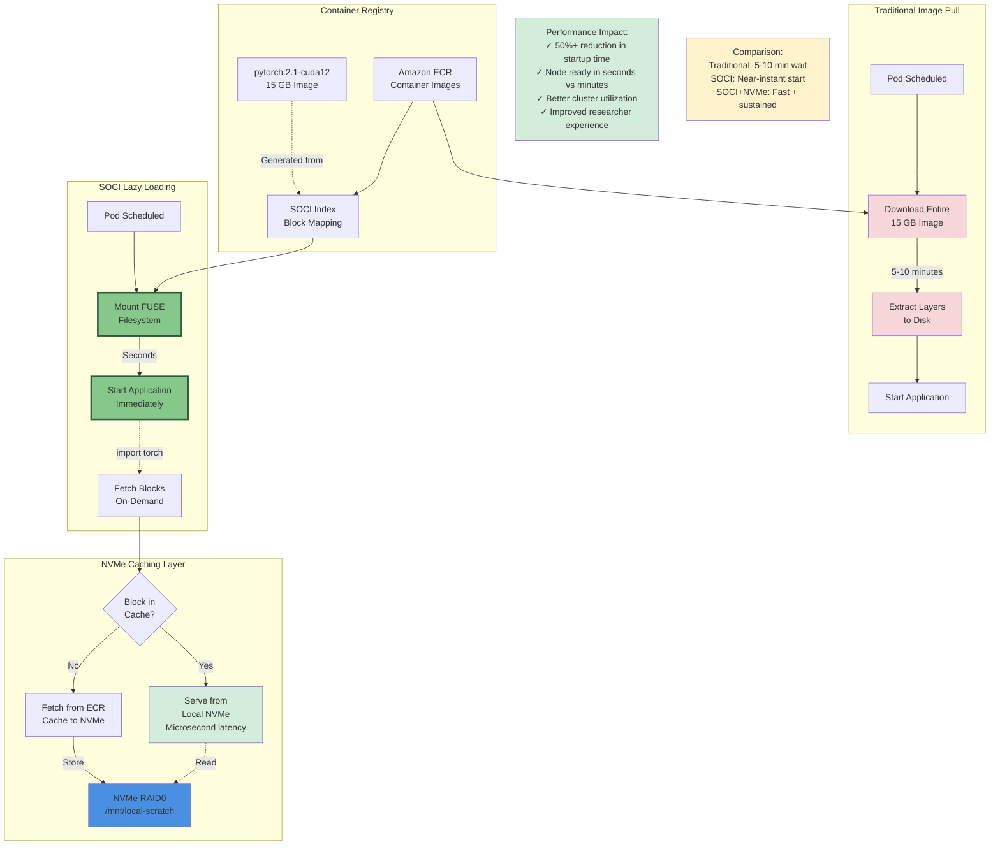
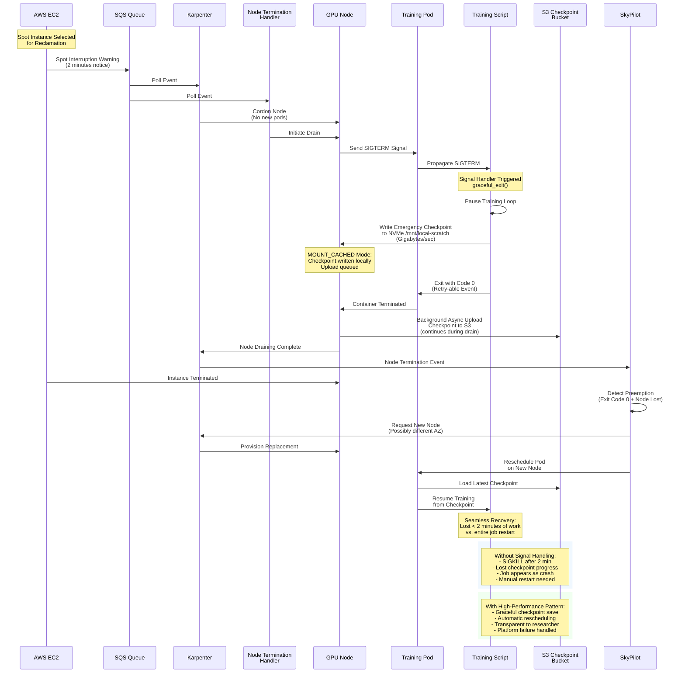
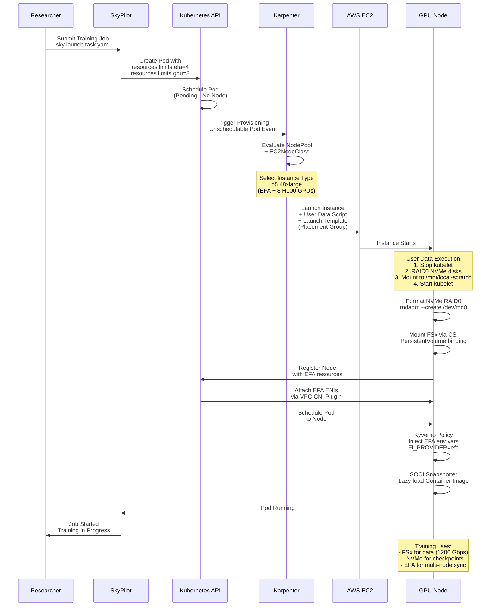

# High-Performance Compute-as-a-Service Architecture
## SkyPilot on EKS: Bridging Cloud-Native and HPC for Optimal Researcher Experience

---

## Slide 1: Title Slide

**High-Performance Compute-as-a-Service Architecture**

**SkyPilot on EKS: Technology Stack for Maximum Researcher Experience**

Architectural Decisions and Requirements for HPC Research Platforms

---

## Slide 2: The Challenge - Bridging the Abstraction Gap

**Standard Kubernetes Patterns Are Insufficient for Deep Learning Workloads**

The fundamental challenge in building a Compute-as-a-Service platform lies in bridging the "gap of abstraction" between general-purpose Kubernetes constructs and the rigorous demands of high-performance computing. Standard Kubernetes prioritizes resilience and availability over raw throughput and latency—a prioritization that must be inverted for HPC workloads.

**Key Mismatches:**
- **TCP networking** is insufficient for LLM training synchronization requirements (NCCL collective operations)
- **Standard EBS volumes** introduce I/O wait times that starve expensive GPUs of data
- **Default container image pulls** create 5-10 minute startup delays that destroy interactivity
- **Generic logging** makes debugging difficult when researchers need to track jobs across pod restarts
- **Blind failure handling** wastes compute hours when spot instances are reclaimed

**Researcher Experience (RX) Definition:** Minimization of infrastructure friction—latency in job startup, complexity in data access, and opacity in failure recovery—while maximizing computational throughput and cost-efficiency.



---

## Slide 3: Storage Architecture - The Storage Trilemma

**FSx for Lustre + NVMe RAID0 Provides Full POSIX Compliance with 1200 Gbps Throughput**

The storage subsystem is the gravamen of any ML platform. The architectural decision involves complex trade-offs between POSIX compliance, throughput performance, cost, and operational complexity. Three primary options exist, each with distinct performance profiles.

**Storage Options Comparison:**

**Mountpoint for S3 (The "Easy Way"):**
- Cost-effective with only S3 request/storage costs
- Optimized for sequential reads, can saturate 100 Gbps links
- **Critical Limitation:** Lacks full POSIX support—fails with random writes, file locking, directory renaming
- Metadata operations (listing millions of files) are orders of magnitude slower than metadata-optimized systems
- Creates "leaky abstraction" forcing researchers to modify code for storage limitations

**FSx for Lustre (The "High-Performance Way"):**
- Fully managed parallel file system with native S3 integration
- Stripes data across multiple storage servers for parallel I/O streams
- **Scratch deployment type** acts as high-speed cache for S3 data with lazy loading
- When coupled with EFA, achieves **1200 Gbps throughput** using Scalable Reliable Datagram (SRD) protocol
- Full POSIX compliance supports file locking, partial writes, atomic renames
- Benchmarks show 4–15x faster than standard S3 clients depending on file size and concurrency

**NVMe Instance Stores:**
- Ephemeral, physically attached storage (e.g., p5 instances have terabytes of NVMe)
- Provides millions of IOPS with microsecond latency
- Ideal for caching layers and temporary processing that exceeds RAM
- **Must be formatted and mounted at boot** via Karpenter automation or remains unutilized

**Recommended Architecture:** FSx for Lustre Scratch + automated NVMe RAID0 for local caching and checkpoint acceleration.



---

## Slide 4: Storage Data Flow - From S3 to GPU

**FSx Lazy-Loading with NVMe Caching Eliminates I/O Bottlenecks**

The high-performance storage architecture creates a multi-tier caching hierarchy that transparently accelerates data access while maintaining S3 as the source of truth. This design eliminates I/O bottlenecks that would otherwise starve expensive GPUs.

**Data Flow Mechanics:**

**Initial Access (Lazy Loading):**
- FSx for Lustre is linked to S3 bucket containing training datasets
- On first file access, FSx lazy-loads data from S3 into high-performance Object Storage Targets (OSTs)
- Metadata servers (MDTs) coordinate parallel I/O streams across multiple OSTs
- Data flows at **1200 Gbps** via EFA using Scalable Reliable Datagram (SRD) protocol

**Active Training:**
- Training pods mount FSx at `/mnt/data` as standard POSIX filesystem
- Local page cache in RAM buffers frequently accessed data
- NVMe RAID0 at `/mnt/local-scratch` provides overflow cache and temporary workspace
- Checkpoint writes use **MOUNT_CACHED mode**: write to local NVMe at gigabytes/second, async upload to S3

**Checkpoint Persistence:**
- Background processes asynchronously upload modified data back to S3 via data repository tasks
- Training loop continues without blocking on S3 write latency
- Reduces "checkpoint tax" (GPU idle time) by nearly 10x compared to direct S3 writes

**Performance Impact:** This architecture transforms storage from a bottleneck into a transparent accelerator, enabling researchers to use standard file operations without refactoring for object storage idiosyncrasies.

```mermaid
graph LR
    subgraph "Object Storage"
        S3[(Amazon S3<br/>Training Data<br/>Checkpoints)]
    end
    
    subgraph "FSx for Lustre Scratch"
        FSX_META[Metadata Servers<br/>MDT]
        FSX_DATA[Object Storage<br/>Targets OST]
        FSX_META -.->|Coordinates| FSX_DATA
    end
    
    subgraph "GPU Instance p5.48xlarge"
        direction TB
        POD[Training Pod<br/>PyTorch/JAX]
        
        subgraph "File System Layers"
            MOUNT[/mnt/data<br/>FSx Mount Point]
            CACHE[Local Page Cache<br/>RAM Buffer]
        end
        
        subgraph "Local NVMe RAID0"
            NVME[/mnt/local-scratch<br/>8x 1TB NVMe<br/>Striped RAID0]
        end
        
        POD -->|Read Dataset| MOUNT
        POD -->|Write Checkpoint| MOUNT
        POD -->|Temp Files| NVME
        
        MOUNT <-->|Cache Hit/Miss| CACHE
    end
    
    S3 <-->|Lazy Load<br/>on First Access| FSX_DATA
    S3 <-.->|Export Changed<br/>via Data Repo Task| FSX_DATA
    
    FSX_DATA <-->|1200 Gbps<br/>via EFA + SRD| MOUNT
    FSX_META <-->|Metadata Ops| MOUNT
    
    CACHE -.->|Overflow| NVME
    
    MOUNT -.->|MOUNT_CACHED<br/>Async Upload| S3
    
    classDef storage fill:#85C88A
    classDef compute fill:#4A90E2
    classDef cache fill:#F4A261
    
    class S3,FSX_META,FSX_DATA storage
    class POD compute
    class CACHE,NVME cache
```

---

## Slide 5: High-Performance Networking - EFA and OS-Bypass

**Elastic Fabric Adapter Reduces Multi-Node Training Latency by 10x Through Kernel Bypass**

In distributed deep learning, the network becomes the backplane of the computer. The efficiency of All-Reduce operations—where every GPU synchronizes gradients with every other GPU—is dominated by network latency. Standard TCP networking introduces "bubble time" where expensive GPUs sit idle waiting for packets.

**EFA Architecture and Benefits:**

**Scalable Reliable Datagram (SRD) Protocol:**
- Unlike TCP's strict packet ordering (causing head-of-line blocking), SRD sprays packets across all available network paths (ECMP)
- Reorders packets at receiver, recovering from link failures in microseconds
- Utilizes full bisection bandwidth of AWS network fabric

**OS-Bypass Mechanism:**
- Traditional TCP path: Application → Kernel TCP/IP stack → Context switches → NIC
- EFA path: Application → libfabric → EFA provider → **Direct hardware access** → Network
- Eliminates kernel overhead and enables RDMA (Remote Direct Memory Access) operations
- Zero-copy data transfer directly from GPU memory to network interface

**Performance Impact:**
- Each EFA interface provides **400 Gbps** throughput (p5.48xlarge has multiple EFAs)
- Critical for NCCL collective operations in multi-node LLM training
- Without EFA, jobs silently fall back to TCP running **10x slower** than possible

**Integration Challenge:** Hardware capability is useless if software is unaware. NCCL requires specific environment variables (`FI_PROVIDER=efa`, `FI_EFA_USE_DEVICE_RDMA=1`) to utilize EFA. Relying on researchers to set these creates silent performance regression.

**Solution:** Automated configuration via Kyverno policies (covered in next slide).



---

## Slide 6: Automated Configuration - Kyverno Policy Engine

**Kyverno Policies Prevent Silent Performance Degradation by Auto-Injecting EFA Configuration**

The "High-Performance Way" decouples infrastructure complexity from user job definitions. Kyverno, a Kubernetes-native policy engine, automatically mutates pod specifications at admission time to inject required environment variables for EFA-enabled workloads.

**The Silent Degradation Problem:**
- Researchers submit jobs requesting EFA resources (`vpc.amazonaws.com/efa: 4`)
- Without proper environment variables, NCCL falls back to standard TCP networking
- Jobs run successfully but **10x slower than possible** with no error messages
- Researchers waste compute hours without realizing the performance loss

**Kyverno Solution - Policy-as-Code:**

**Policy Logic:**
1. **Match Condition:** Watch for any pod requesting `vpc.amazonaws.com/efa` resource
2. **Precondition Check:** Verify EFA resource limit is set (not empty)
3. **Mutation Action:** Automatically inject environment variables into all containers

**Injected Environment Variables:**
- `FI_PROVIDER=efa` - Directs libfabric to use EFA provider
- `FI_EFA_USE_DEVICE_RDMA=1` - Enables RDMA operations
- `NCCL_DEBUG=INFO` - Provides visibility into NCCL transport selection
- `NCCL_PROTO=simple` - Optimizes protocol for EFA characteristics

**Researcher Experience Impact:**
- Researchers define resource requirements, not infrastructure details
- Platform guarantees optimal configuration automatically
- Eliminates entire class of performance bugs
- Maintains abstraction: users think about "I need EFA" not "I need to export FI_PROVIDER"



---

## Slide 7: Cluster Placement Groups - Minimizing Physical Latency

**Placement Groups Reduce Network Latency from 100-500μs to 10-20μs Through Physical Proximity**

While EFA optimizes the network protocol, Cluster Placement Groups optimize the physics. They ensure instances are physically located in the same rack or adjacent racks within an Availability Zone, minimizing speed-of-light latency and maximizing bisection bandwidth.

**Physical Topology Benefits:**

**Within Placement Group:**
- Instances provisioned in same or adjacent racks
- Connected via high-bandwidth Top-of-Rack (ToR) switches
- Network latency: **10-20 microseconds**
- Full bisection bandwidth available for multi-node communication
- Critical for 512+ GPU training jobs where network becomes the bottleneck

**Without Placement Group (Scattered):**
- Instances may be in different buildings or data halls
- Traffic traverses multiple spine switches
- Network latency: **100-500 microseconds** (5-25x higher)
- Reduced effective bandwidth due to contention
- GPU utilization drops from 90% to 60-70% due to synchronization delays

**Karpenter Integration Challenge:**
- Karpenter v1.0+ lacks native field for dynamic placement group creation per job
- Significant gap compared to traditional HPC schedulers like Slurm

**High-Performance Workaround:**
1. **Pre-provision** static Cluster Placement Groups (e.g., `ml-cluster-group-a`, `ml-cluster-group-b`)
2. **Launch Template** specifies placement configuration pointing to these groups
3. **EC2NodeClass** references the Launch Template via `launchTemplateName`
4. **Capacity Blocks for ML** (512 H100 reservations) inherently include placement groups

**Performance Impact:** For large-scale multi-node LLM training, proper placement is the difference between 90% GPU utilization and 60-70% utilization—directly affecting cost-efficiency and training time.



---

## Slide 8: Observability - User-Centric Logging with Fluent Bit

**Task-Based Log Streams Reduce Mean Time to Debug by Organizing Logs Around Researcher Intent**

In a multi-tenant Compute-as-a-Service environment, an "observability chasm" exists between the scheduler (SkyPilot) and the execution environment (Kubernetes). Researchers interact with Task IDs, but Kubernetes operates on Pod UIDs. Default logging makes it frustratingly difficult to find logs for a specific job, especially across retries.

**The Traditional Problem:**
- Researchers submit job `sky-job-123`
- Job may create multiple pods due to retries: `pod-12345`, `pod-67890`, `pod-34567`
- CloudWatch Container Insights creates separate log streams per pod
- Researcher must manually search across disconnected streams to reconstruct job history
- "Last gasp" logs from spot interruptions are lost when nodes terminate

**High-Performance Solution - Fluent Bit Rewrite Pipeline:**

**Label Injection:**
- SkyPilot automatically labels pods with `skypilot.task_id` and `skypilot.cluster_name`
- Kubernetes metadata enriches log entries with these labels

**Rewrite Tag Filter:**
- Fluent Bit extracts `skypilot.task_id` from Kubernetes metadata
- Constructs new routing tag: `skypilot.task.sky-job-123`
- All logs from all pods for same task route to single stream

**CloudWatch Output:**
- Log stream named by task: `/skypilot/user-jobs/task-sky-job-123`
- Coherent job history across all retries and restarts in single location
- Researchers query by their mental model (task ID) not infrastructure detail (pod ID)

**Spot Interruption Handling:**
- Node Termination Handler monitors SQS queue for 2-minute spot warnings
- Sends flush signal to Fluent Bit to immediately push buffered logs
- Secondary S3 archive via Kinesis Firehose acts as "black box" for massive failures

**Impact:** Drastically reduces Mean Time To Debug—researchers find their logs immediately instead of hunting across multiple pod streams.

```mermaid
graph TB
    subgraph "Training Pods"
        POD1[Pod: sky-job-123-0<br/>Labels:<br/>skypilot.task_id=sky-job-123]
        POD2[Pod: sky-job-123-1<br/>Retry after failure<br/>skypilot.task_id=sky-job-123]
        POD3[Pod: sky-job-456-0<br/>Labels:<br/>skypilot.task_id=sky-job-456]
    end
    
    subgraph "Log Collection - Fluent Bit DaemonSet"
        FB[Fluent Bit Agent<br/>on Each Node]
        
        subgraph "Processing Pipeline"
            INPUT[Input: Container Logs<br/>+ Kubernetes Metadata]
            REWRITE[Rewrite Tag Filter<br/>Extract skypilot.task_id<br/>from labels]
            TAG[New Tag:<br/>skypilot.task.sky-job-123]
        end
    end
    
    subgraph "Destinations"
        direction LR
        
        subgraph "Real-time Logs"
            CW[CloudWatch Logs<br/>Log Groups by Task]
            STREAM1[/skypilot/user-jobs<br/>task-sky-job-123]
            STREAM2[/skypilot/user-jobs<br/>task-sky-job-456]
        end
        
        subgraph "Archival Black Box"
            S3[S3 Bucket<br/>via Kinesis Firehose<br/>Raw Log Archive]
        end
    end
    
    subgraph "Spot Interruption Handling"
        NTH[Node Termination<br/>Handler]
        SQS[SQS Queue<br/>Spot Warnings]
        FLUSH[Flush Signal<br/>to Fluent Bit]
    end
    
    POD1 -->|stdout/stderr| FB
    POD2 -->|stdout/stderr| FB
    POD3 -->|stdout/stderr| FB
    
    FB --> INPUT
    INPUT --> REWRITE
    REWRITE --> TAG
    
    TAG -->|Task-based routing| CW
    TAG -->|Backup stream| S3
    
    CW --> STREAM1
    CW --> STREAM2
    
    SQS -->|2-min warning| NTH
    NTH -->|Cordon + Drain| POD1
    NTH --> FLUSH
    FLUSH -.->|Emergency flush| FB
    
    USER[Researcher]
    USER -->|Query by Task ID<br/>sky-job-123| STREAM1
    
    Note1[Traditional Problem:<br/>Logs scattered across<br/>pod-12345, pod-67890<br/>Hard to find job history]
    
    Note2[Solution:<br/>All retries and restarts<br/>in single task stream<br/>Coherent job history]
    
    style REWRITE fill:#85C88A,stroke:#2D5F3E,stroke-width:3px
    style STREAM1 fill:#4A90E2
    style FLUSH fill:#F4A261
    style Note1 fill:#F8D7DA
    style Note2 fill:#D4EDDA
```

---

## Slide 9: Image Vending - SOCI Lazy Loading

**SOCI Snapshotter Reduces Container Startup Time by 50%+ Through On-Demand Block Fetching**

Container image pull times are the "silent killer" of interactivity and cluster efficiency. Standard deep learning containers are often 15GB+, taking 5-10 minutes to pull on a fresh node. In a dynamic Karpenter environment where nodes are provisioned just-in-time, this latency destroys the "interactive" feel of the platform.

**Traditional Approach - Pre-warmed AMIs:**
- Bake ML dependencies (PyTorch, TensorFlow, CUDA) into custom AMI
- **Pros:** Near-instant start if user requirements exactly match AMI
- **Cons:** Extremely rigid—if user needs `pytorch:2.1` but AMI has `2.0`, system reverts to full image pull
- High operational burden: gold image pipelines, constant patching, version sprawl

**SOCI (Seekable OCI) - The Modern Solution:**

**Lazy Loading Mechanism:**
- SOCI creates an index of the container image (stored in ECR alongside image)
- SOCI snapshotter in containerd mounts a FUSE filesystem
- Application starts **immediately** without downloading entire image
- When application executes `import torch`, FUSE filesystem fetches only the specific blocks needed from registry

**Hybrid Optimization - SOCI + NVMe Caching:**
- NVMe RAID0 (provisioned by Karpenter) serves as local cache for SOCI snapshotter
- First access fetches blocks over network and caches to NVMe
- Subsequent accesses serve from local NVMe at microsecond latency
- Mitigates FUSE overhead for repeated operations during training

**Performance Benchmarks:**
- **Traditional pull:** 5-10 minutes in ContainerCreating status
- **SOCI:** Seconds from provisioned to running user code
- **50%+ reduction** in startup latency for large ML images
- Better cluster utilization—nodes productive immediately instead of waiting

**Researcher Experience Impact:** Platform feels "interactive" and responsive. Researchers can rapidly iterate on experiments instead of waiting for infrastructure.



---

## Slide 10: Failure Handling - Graceful Spot Interruption Recovery

**SIGTERM Signal Handling with MOUNT_CACHED Checkpoints Prevents Wasted Compute Hours**

In a cost-efficient ML platform, spot instances are fundamental. However, spot interruptions are inevitable—AWS provides 2-minute warning before reclamation. Without architectural intervention, these interruptions result in lost progress and wasted compute hours. The platform must distinguish between "Platform Failures" (spot preemption) and "User Failures" (code bugs) and make platform failures transparent.

**The Critical Gap - Default Behavior:**
- AWS emits Spot Interruption Warning (2 minutes notice)
- Karpenter cordons and drains node
- Kubernetes sends SIGTERM to pods
- **Problem:** Many ML scripts (especially Python) ignore SIGTERM by default
- Scripts continue running until SIGKILL after 2 minutes
- All progress since last checkpoint is lost
- SkyPilot sees job as "crashed" rather than "preempted"

**High-Performance Solution - Signal Handling + MOUNT_CACHED:**

**Signal Propagation Chain:**
1. AWS → SQS Queue (Spot Warning)
2. Karpenter + Node Termination Handler consume event
3. Node cordoned and drain initiated
4. SIGTERM sent to training pods
5. **Application signal handler triggered**

**Graceful Checkpoint Pattern:**
```python
import signal
import sys

def graceful_exit(signum, frame):
    print("Caught SIGTERM. Saving emergency checkpoint...")
    save_checkpoint()  # Write to local NVMe
    sys.exit(0)  # Exit code 0 = retry-able event

signal.signal(signal.SIGTERM, graceful_exit)
```

**MOUNT_CACHED Acceleration:**
- Checkpoint written to local NVMe RAID0 at **gigabytes per second**
- Training loop resumes immediately (no blocking on S3 write)
- Background process asynchronously uploads to S3
- Reduces "checkpoint tax" (GPU idle time) by nearly 10x

**Recovery Flow:**
- SkyPilot detects preemption (exit code 0 + node lost)
- Automatically reschedules task on new node (possibly different AZ)
- Loads latest checkpoint from S3
- Resumes training seamlessly—lost < 2 minutes of work vs. entire job restart

**Impact:** Transforms spot interruptions from catastrophic failures into transparent platform events. Researchers experience seamless recovery without manual intervention.



---

## Slide 11: Karpenter Provisioning - Automated Node Configuration

**Karpenter EC2NodeClass with User Data Automation Ensures Optimal Node Configuration at Boot**

Karpenter's EC2NodeClass is the definitive mechanism for codifying the configuration of underlying compute nodes. The "High-Performance Way" uses this to automate NVMe RAID0 formatting, FSx mounting, and EFA attachment—ensuring nodes are optimally configured before accepting workloads.

**Provisioning Sequence:**

**1. Job Submission:**
- Researcher submits SkyPilot task requesting 8 GPUs + EFA resources
- SkyPilot generates Kubernetes Pod specification with resource limits

**2. Karpenter Evaluation:**
- Kubernetes scheduler finds no suitable node (pod pending)
- Karpenter evaluates NodePool and EC2NodeClass constraints
- Selects instance type: p5.48xlarge (8 H100 GPUs, EFA support, 8x 1TB NVMe)

**3. Instance Launch with Automation:**
- Karpenter launches EC2 instance with User Data script
- Launch Template specifies Cluster Placement Group for low latency
- User Data executes **before kubelet starts**

**4. User Data Execution (Critical for Performance):**
```bash
# Stop kubelet to prevent race conditions
systemctl stop kubelet

# Identify and RAID0 NVMe disks (excluding root)
devices=$(lsblk -dno NAME | grep nvme | grep -v nvme0n1)
mdadm --create /dev/md0 --level=0 --raid-devices=8 /dev/$devices
mkfs.xfs /dev/md0
mount /dev/md0 /mnt/local-scratch
chmod 777 /mnt/local-scratch

# Start kubelet
systemctl start kubelet
```

**5. Resource Attachment:**
- VPC CNI Plugin attaches EFA ENIs (4x 400 Gbps interfaces)
- FSx CSI Driver mounts parallel file system via PersistentVolume
- Node registers with Kubernetes advertising GPU, EFA, and storage resources

**6. Policy Automation:**
- Kyverno policy detects EFA resource request
- Auto-injects environment variables (`FI_PROVIDER=efa`, etc.)

**7. Image Loading:**
- SOCI snapshotter lazy-loads container image
- NVMe cache accelerates subsequent block fetches

**8. Job Execution:**
- Pod scheduled to node and starts immediately
- Training uses FSx for data (1200 Gbps), NVMe for checkpoints, EFA for multi-node sync

**Impact:** Entire provisioning sequence—from job submission to training start—completes in minutes instead of hours. Automation ensures consistent, optimal configuration without manual intervention.



---

## Slide 12: Decision Matrix - Ranked Architectural Choices

**Evidence Unequivocally Supports FSx, EFA, and SOCI as Foundation for Maximum Researcher Experience**

The architectural decisions are ranked by their impact on Researcher Experience (RX) and performance. Default configurations favor operational simplicity over RX—the "High-Performance Way" inverts this prioritization to maximize researcher productivity and minimize infrastructure friction.

**Ranking Methodology:**
- **Critical Impact:** Prevents job failures or eliminates major bottlenecks
- **High Impact:** Significantly improves performance or interactivity
- **Medium Impact:** Reduces debugging time or provides cost-free performance gains

**Rank 1 - CRITICAL: Data & Storage**
- **Easy Way:** Mountpoint for S3 (free, simple, limited POSIX, slow metadata)
- **High-Performance Way:** FSx for Lustre + NVMe RAID0 (full POSIX, 1200 Gbps, local caching)
- **Impact:** Enables training on massive datasets without I/O bottlenecks; prevents job crashes due to file system incompatibilities

**Rank 2 - HIGH: Networking**
- **Easy Way:** Standard VPC CNI (works for single-node, TCP overhead)
- **High-Performance Way:** EFA + Kyverno auto-config (OS-bypass, 400 Gbps per interface, essential for multi-node)
- **Impact:** Reduces "bubble time" in distributed training; prevents silent 10x performance degradation

**Rank 3 - HIGH: Image Vending**
- **Easy Way:** Standard image pull (simple, 5-10 min startup)
- **High-Performance Way:** SOCI lazy loading (instant start, NVMe caching, 50%+ faster)
- **Impact:** Makes platform feel "interactive" and responsive; enables faster iteration loops

**Rank 4 - MEDIUM: Observability**
- **Easy Way:** Container Insights (default setup, pod-based logs, hard to find jobs)
- **High-Performance Way:** Fluent Bit + task tagging (task-based streams, coherent history, spot log preservation)
- **Impact:** Drastically reduces Mean Time To Debug for researchers finding their logs

**Rank 5 - MEDIUM: Ephemeral Storage**
- **Easy Way:** EBS volumes only (persistent, network latency, costly at scale)
- **High-Performance Way:** Automated NVMe RAID0 (millions of IOPS, free ephemeral, Karpenter automation)
- **Impact:** Provides "free" high-speed scratch space for datasets and checkpoints

**Rank 6 - MEDIUM: Reliability**
- **Easy Way:** Blind job restart (simple retry, lost progress, wasted compute)
- **High-Performance Way:** SIGTERM handling + MOUNT_CACHED (graceful checkpoints, async S3 upload, auto-rescheduling)
- **Impact:** Prevents lost compute hours by saving state immediately before preemption

**Conclusion:** Implementing the "High-Performance Way" patterns transforms the platform from a simple job scheduler into a true high-performance research accelerator where compute is nearly instantaneous and storage is transparently performant.

```mermaid
graph TB
    subgraph "Architectural Decision Matrix - Ranked by RX Impact"
        direction TB
        
        subgraph "Rank 1 - CRITICAL: Data & Storage"
            R1_EASY[Easy Way:<br/>Mountpoint for S3<br/>✓ Free, Simple<br/>✗ Limited POSIX<br/>✗ Slow Metadata]
            R1_HP[High-Performance Way:<br/>FSx Lustre + NVMe RAID0<br/>✓ Full POSIX<br/>✓ 1200 Gbps throughput<br/>✓ Local caching<br/>Impact: Prevents I/O bottlenecks]
            
            R1_EASY -.->|Upgrade| R1_HP
        end
        
        subgraph "Rank 2 - HIGH: Networking"
            R2_EASY[Easy Way:<br/>Standard VPC CNI<br/>✓ Works for single-node<br/>✗ TCP overhead<br/>✗ Limited bandwidth]
            R2_HP[High-Performance Way:<br/>EFA + Kyverno Auto-config<br/>✓ OS-bypass networking<br/>✓ 400 Gbps per interface<br/>✓ Essential for multi-node<br/>Impact: Reduces bubble time]
            
            R2_EASY -.->|Upgrade| R2_HP
        end
        
        subgraph "Rank 3 - HIGH: Image Vending"
            R3_EASY[Easy Way:<br/>Standard Image Pull<br/>✓ Simple<br/>✗ 5-10 min startup<br/>✗ Poor interactivity]
            R3_HP[High-Performance Way:<br/>SOCI Lazy Loading<br/>✓ Instant start<br/>✓ NVMe caching<br/>✓ 50%+ faster<br/>Impact: Interactive feel]
            
            R3_EASY -.->|Upgrade| R3_HP
        end
        
        subgraph "Rank 4 - MEDIUM: Observability"
            R4_EASY[Easy Way:<br/>Container Insights<br/>✓ Default setup<br/>✗ Pod-based logs<br/>✗ Hard to find jobs]
            R4_HP[High-Performance Way:<br/>Fluent Bit + Task Tagging<br/>✓ Task-based streams<br/>✓ Coherent history<br/>✓ Spot log preservation<br/>Impact: Faster debugging]
            
            R4_EASY -.->|Upgrade| R4_HP
        end
        
        subgraph "Rank 5 - MEDIUM: Ephemeral Storage"
            R5_EASY[Easy Way:<br/>EBS Volumes Only<br/>✓ Persistent<br/>✗ Network latency<br/>✗ Cost at scale]
            R5_HP[High-Performance Way:<br/>Automated NVMe RAID0<br/>✓ Millions of IOPS<br/>✓ Free ephemeral<br/>✓ Karpenter automation<br/>Impact: Free performance]
            
            R5_EASY -.->|Upgrade| R5_HP
        end
        
        subgraph "Rank 6 - MEDIUM: Reliability"
            R6_EASY[Easy Way:<br/>Blind Job Restart<br/>✓ Simple retry<br/>✗ Lost progress<br/>✗ Wasted compute]
            R6_HP[High-Performance Way:<br/>SIGTERM + MOUNT_CACHED<br/>✓ Graceful checkpoints<br/>✓ Async S3 upload<br/>✓ Auto-rescheduling<br/>Impact: Saves compute hours]
            
            R6_EASY -.->|Upgrade| R6_HP
        end
    end
    
    PRINCIPLE[Guiding Principle:<br/>Default configurations favor<br/>operational simplicity over RX.<br/>High-Performance Way inverts this<br/>to maximize researcher experience.]
    
    style R1_HP fill:#85C88A,stroke:#2D5F3E,stroke-width:4px
    style R2_HP fill:#85C88A,stroke:#2D5F3E,stroke-width:3px
    style R3_HP fill:#85C88A,stroke:#2D5F3E,stroke-width:3px
    style R4_HP fill:#A8D5BA,stroke:#2D5F3E,stroke-width:2px
    style R5_HP fill:#A8D5BA,stroke:#2D5F3E,stroke-width:2px
    style R6_HP fill:#A8D5BA,stroke:#2D5F3E,stroke-width:2px
    
    style R1_EASY fill:#F8D7DA
    style R2_EASY fill:#F8D7DA
    style R3_EASY fill:#F8D7DA
    style R4_EASY fill:#FFF3CD
    style R5_EASY fill:#FFF3CD
    style R6_EASY fill:#FFF3CD
    
    style PRINCIPLE fill:#E7F3FF
```



---

## Slide 13: Hardening & Fallback Plan (Gaps to Close)

**Resiliency**
- Add multi-AZ option or backup FSx/ONTAP plus a “degraded mode” (no placement groups/EFA) when capacity is constrained.
- Define FSx scratch lifecycle: data repo sync cadence, TTL/quotas for scratch, and checkpoint durability guarantees back to S3.

**Security & Tenancy**
- Per-tenant namespaces + IRSA, GPU/EFA quota policies, PodSecurity + NetworkPolicy defaults, scoped FSx/S3 access, secrets management, and image signing/verification.

**Provisioning Robustness**
- Health checks in user-data/systemd for mdadm/FSx/EFA bring-up; fail fast on mount/attach errors; guard against rooting the wrong NVMe; record bootstrap timings.

**Spot Handling**
- Provide platform-side pre-stop hook/sidecar to capture emergency checkpoints even if user code lacks SIGTERM handling; confirm checkpoints persisted to S3 before node termination.

**Observability**
- Add DCGM GPU metrics, NCCL/EFA transport choice, boot/provision latency, and cost attribution per task; set CloudWatch/S3 retention budgets.

**SOCI & Supply Chain**
- Define behavior when SOCI index is missing, prefetch guidance for hot libraries, compatibility requirements (containerd/Bottlerocket), and enforce image signing/provenance.
