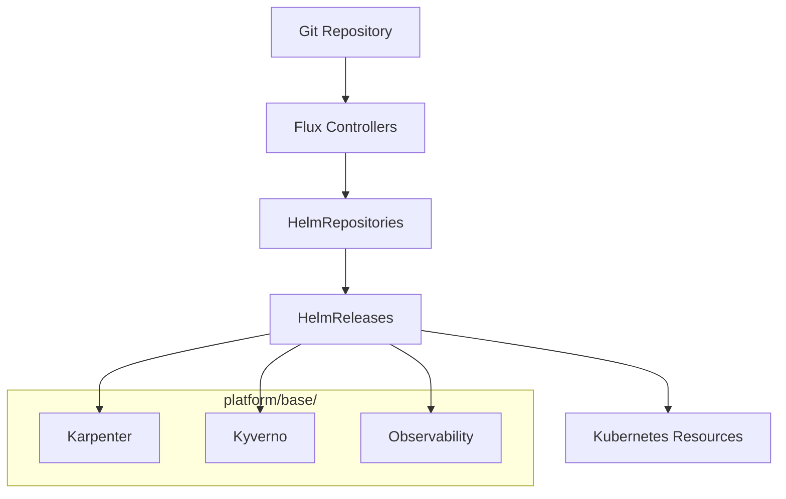

# Component Reference

Technical reference documentation for Skyhook's infrastructure components.

## Components

| Component | Location | Purpose |
|-----------|----------|---------|
| [Kyverno](kyverno.md) | `platform/base/kyverno/` | Policy automation for HPC workloads |
| [SkyPilot Infra](skypilot-infra.md) | `platform/base/karpenter/` | Karpenter provisioners and SkyPilot configs |
| [Platform Base](platform-base.md) | `platform/base/` | Flux HelmReleases for platform services |
| [Control Plane](control-plane.md) | `control/base/` | Quotas, scheduling, RBAC configs |

## Repository Structure Overview

```
SM-13/
├── cluster/                  # EKS cluster configuration
│   ├── eksctl-template.yaml  # EKS cluster template
│   ├── iam-cluster.yaml      # IAM roles CloudFormation
│   └── Makefile              # Cluster operations
│
├── foundation/               # VPC and storage infrastructure
│   ├── templates/            # CloudFormation templates
│   └── params/               # Environment parameters
│
├── platform/                 # Platform services
│   └── base/
│       ├── cni/              # VPC CNI configuration
│       ├── csi-*/            # Storage drivers (EBS, EFS, FSx)
│       ├── dcgm-exporter/    # GPU metrics
│       ├── external-dns/     # DNS management
│       ├── karpenter/        # Node provisioning
│       ├── keda/             # Event-driven autoscaling
│       ├── kyverno/          # Policy automation
│       │   └── policies/     # ClusterPolicy definitions
│       ├── load-balancer/    # AWS LB controller
│       ├── logging/          # Fluent Bit logging
│       ├── observability/    # Prometheus/Grafana
│       ├── secrets-store-csi/# Secrets management
│       └── sources/          # Helm repositories
│
├── docs/                     # Documentation
│   ├── guides/               # User guides
│   ├── internal/             # Internal docs (ADRs, runbooks)
│   ├── platform/             # Platform documentation
│   └── reference/            # Reference documentation
│
└── tests/                    # Integration tests
```

## Flux Reconciliation Flow



## Key Configuration Files

| File | Purpose |
|------|---------|
| `platform/base/karpenter/nodepools.yaml` | NodePool definitions by tier |
| `platform/base/karpenter/ec2nodeclasses.yaml` | EC2 node configurations |
| `platform/base/kyverno/policies/inject-efa-env.yaml` | EFA environment injection |
| `platform/base/kyverno/policies/inject-hpc-tolerations.yaml` | HPC toleration injection |
| `platform/base/logging/helmrelease.yaml` | Fluent Bit configuration |

## Making Changes

1. **Edit manifests**: Modify files in `platform/base/`
2. **Validate**: Use `kubectl apply --dry-run=client`
3. **Apply**: Flux reconciles or manual `kubectl apply`
4. **Verify**: Check resource state

```bash
# Validate manifests
kubectl apply --dry-run=client -f platform/base/kyverno/policies/

# Check HelmRelease status
kubectl get helmrelease -n flux-system

# View Flux logs
flux logs --follow

# Check Kyverno policies
kubectl get clusterpolicy
```
