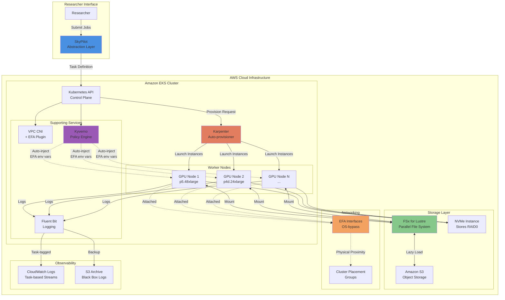
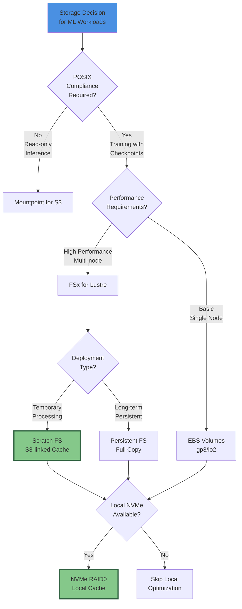
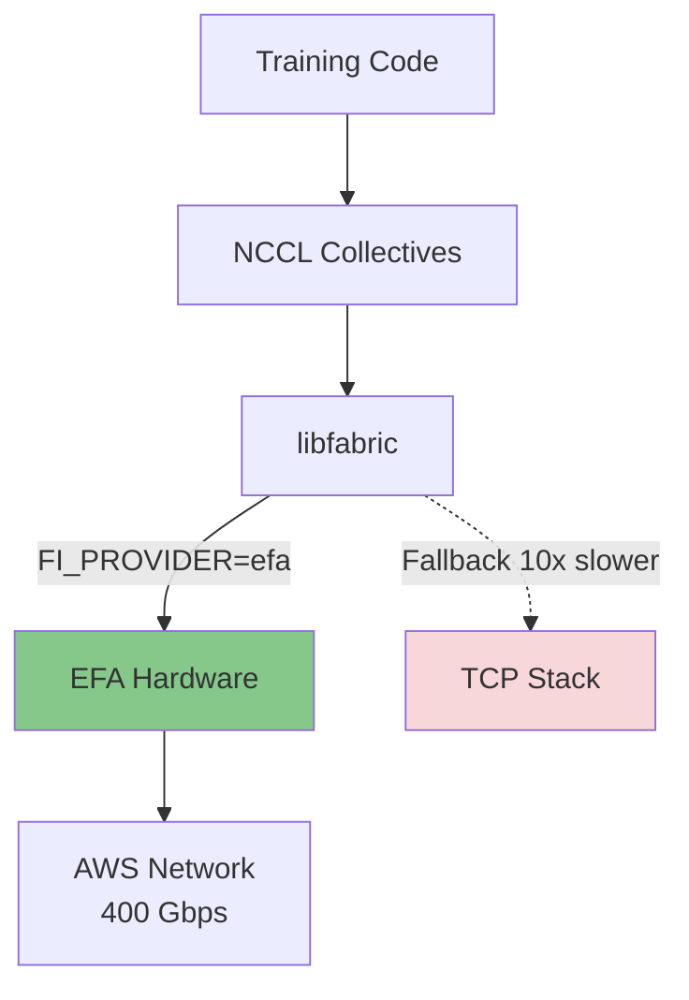
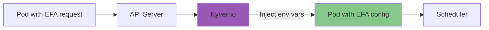

# Skyhook Architecture Presentation

*Comprehensive slide deck with embedded Mermaid diagrams*

## SkyPilot on EKS: Bridging Cloud-Native and HPC for Optimal Researcher Experience

---

## Slide 1: Title Slide

**High-Performance Compute-as-a-Service Architecture**

**SkyPilot on EKS: Technology Stack for Maximum Researcher Experience**

Architectural Decisions and Requirements for HPC Research Platforms

---

## Slide 2: The Challenge - Bridging the Abstraction Gap

**Standard Kubernetes Patterns Are Insufficient for Deep Learning Workloads**

The fundamental challenge in building a Compute-as-a-Service platform lies in bridging the "gap of abstraction" between general-purpose Kubernetes constructs and the rigorous demands of high-performance computing. Standard Kubernetes prioritizes resilience and availability over raw throughput and latency—a prioritization that must be inverted for HPC workloads.

**Key Mismatches:**

- **TCP networking** is insufficient for LLM training synchronization requirements (NCCL collective operations)
- **Standard EBS volumes** introduce I/O wait times that starve expensive GPUs of data
- **Default container image pulls** create 5-10 minute startup delays that destroy interactivity
- **Generic logging** makes debugging difficult when researchers need to track jobs across pod restarts
- **Blind failure handling** wastes compute hours when spot instances are reclaimed

**Researcher Experience (RX) Definition:** Minimization of infrastructure friction—latency in job startup, complexity in data access, and opacity in failure recovery—while maximizing computational throughput and cost-efficiency.



---

## Slide 3: Storage Architecture - The Storage Trilemma

**FSx for Lustre + NVMe RAID0 Provides Full POSIX Compliance with 1200 Gbps Throughput**

The storage subsystem is the gravamen of any ML platform. The architectural decision involves complex trade-offs between POSIX compliance, throughput performance, cost, and operational complexity.

**Storage Options Comparison:**

| Option | Pros | Cons |
|--------|------|------|
| Mountpoint for S3 | Cost-effective, easy setup | Limited POSIX, slow metadata |
| FSx for Lustre | Full POSIX, 1200 Gbps, S3 integration | Higher cost |
| NVMe Instance Stores | Millions of IOPS, microsecond latency | Ephemeral |

**Recommended Architecture:** FSx for Lustre Scratch + automated NVMe RAID0 for local caching and checkpoint acceleration.



---

## Slide 4: Storage Data Flow - From S3 to GPU

**FSx Lazy-Loading with NVMe Caching Eliminates I/O Bottlenecks**

```mermaid
graph LR
    subgraph "Object Storage"
        S3[(Amazon S3<br/>Training Data<br/>Checkpoints)]
    end
    
    subgraph "FSx for Lustre Scratch"
        FSX_META[Metadata Servers<br/>MDT]
        FSX_DATA[Object Storage<br/>Targets OST]
    end
    
    subgraph "GPU Instance p5.48xlarge"
        POD[Training Pod]
        MOUNT[/mnt/data]
        NVME[/mnt/local-scratch<br/>NVMe RAID0]
    end
    
    S3 <-->|Lazy Load| FSX_DATA
    FSX_DATA <-->|1200 Gbps<br/>via EFA| MOUNT
    POD --> MOUNT
    POD --> NVME
    MOUNT -.->|MOUNT_CACHED<br/>Async Upload| S3
```

---

## Slide 5: High-Performance Networking - EFA and OS-Bypass

**Elastic Fabric Adapter Reduces Multi-Node Training Latency by 10x Through Kernel Bypass**

| Path | Latency | Throughput |
|------|---------|------------|
| Traditional TCP | High (kernel overhead) | Limited |
| EFA OS-Bypass | Low (direct hardware) | 400 Gbps per interface |



---

## Slide 6: Automated Configuration - Kyverno Policy Engine

**Kyverno Policies Prevent Silent Performance Degradation by Auto-Injecting EFA Configuration**

When pods request `vpc.amazonaws.com/efa`, Kyverno automatically injects:

- `FI_PROVIDER=efa`
- `FI_EFA_USE_DEVICE_RDMA=1`
- `NCCL_DEBUG=INFO`
- `NCCL_PROTO=simple`



---

## Slide 7: Cluster Placement Groups

**Placement Groups Reduce Network Latency from 100-500μs to 10-20μs Through Physical Proximity**

| Configuration | Latency | GPU Utilization |
|---------------|---------|-----------------|
| Within Placement Group | 10-20 μs | 90% |
| Scattered (no CPG) | 100-500 μs | 60-70% |

---

## Slide 8: Observability - User-Centric Logging

**Task-Based Log Streams Reduce Mean Time to Debug**

- SkyPilot labels pods with `skypilot.task_id`
- Fluent Bit rewrites tags to route by task
- All retries/restarts in single CloudWatch stream: `/skypilot/user-jobs/task-<id>`

---

## Slide 9: Image Vending - SOCI Lazy Loading

**SOCI Snapshotter Reduces Container Startup Time by 50%+**

| Approach | Startup Time |
|----------|--------------|
| Traditional pull | 5-10 minutes |
| SOCI lazy loading | Seconds |

---

## Slide 10: Failure Handling - Graceful Spot Interruption Recovery

**SIGTERM Signal Handling with MOUNT_CACHED Checkpoints Prevents Wasted Compute Hours**

```python
import signal
import sys

def graceful_exit(signum, frame):
    print("Caught SIGTERM. Saving emergency checkpoint...")
    save_checkpoint()  # Write to local NVMe
    sys.exit(0)  # Exit code 0 = retry-able event

signal.signal(signal.SIGTERM, graceful_exit)
```

---

## Slide 11: Karpenter Provisioning - Automated Node Configuration

**Provisioning Sequence:**

1. Researcher submits SkyPilot task
2. Karpenter provisions GPU node
3. User data configures NVMe RAID0
4. FSx mounted via CSI
5. Kyverno injects EFA config
6. SOCI lazy-loads image
7. Training starts

---

## Slide 12: Decision Matrix - Ranked Architectural Choices

| Rank | Domain | Easy Way | High-Performance Way | Impact |
|------|--------|----------|---------------------|--------|
| 1 | Storage | S3 Mountpoint | FSx + NVMe | Critical |
| 2 | Networking | VPC CNI | EFA + Kyverno | High |
| 3 | Images | Standard pull | SOCI | High |
| 4 | Observability | Container Insights | Fluent Bit + tagging | Medium |
| 5 | Ephemeral Storage | EBS only | NVMe RAID0 | Medium |
| 6 | Reliability | Blind restart | SIGTERM + MOUNT_CACHED | Medium |

---

## Slide 13: Hardening & Fallback Plan (Gaps to Close)

**Resiliency**

- Multi-AZ fallback, degraded mode without EFA/placement groups
- FSx scratch lifecycle management

**Security & Tenancy**

- Per-tenant namespaces + IRSA
- GPU/EFA quotas, NetworkPolicies
- Image signing/verification

**Provisioning Robustness**

- Health checks for RAID/FSx/EFA setup
- Fail-fast on errors

**Spot Handling**

- Platform-side checkpoint sidecar
- Ensure S3 persistence before termination

**Observability**

- DCGM GPU metrics
- Cost attribution per task

**SOCI & Supply Chain**

- Fallback when index missing
- Image signing enforcement

