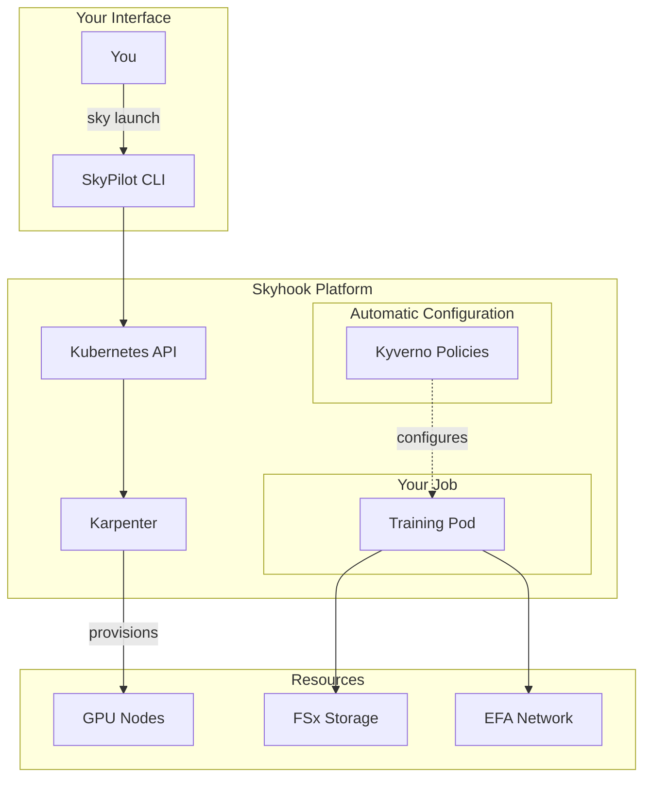

# Architecture

> TODO: This is a simplified view for researchers. For detailed architecture, see [Internal Design Docs](../internal/design/index.md).

## High-Level Overview

## What Happens When You Submit a Job

1. **You run** `sky launch task.yaml`
2. **SkyPilot** translates your task into Kubernetes resources
3. **Karpenter** provisions the exact GPU nodes you need
4. **Kyverno** automatically injects EFA configuration
5. **SOCI** lazy-loads your container image
6. **Your code runs** with FSx mounted and EFA ready

## The "High-Performance Way"

Skyhook is built on what we call the "High-Performance Way"—a set of architectural decisions that prioritize researcher experience over operational simplicity:

| Default Kubernetes | Skyhook |
|-------------------|---------|
| Standard image pull (5-10 min) | SOCI lazy loading (seconds) |
| TCP networking | EFA OS-bypass (10x faster) |
| EBS volumes | FSx + NVMe RAID0 |
| Generic pod logs | Task-based log streams |
| Blind failure restart | Graceful checkpoint + reschedule |

## Learn More

- [Detailed Design Documentation](../internal/design/index.md)
- [Implementation Plan](../internal/design/implementation-plan.md)

